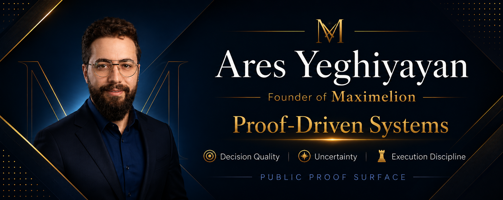

# Ares Yeghiyayan

Founder of **Maximelion**.

I am building a public proof surface around decision quality, uncertainty, and execution discipline.

This profile is not meant to look like a finished company page. It is a public proof surface for how I think, build, review, and improve work over time.

## Current Focus

- Decision quality under uncertainty
- Proof-driven software building
- Risk-aware systems
- Founder-led execution discipline
- Public-safe build rhythm

## Links

- [Review path](REVIEW_PATH.md)
- [Proof index](PROOF_INDEX.md)
- [Reading order](READING_ORDER.md)
- [Public proof repository](https://github.com/ares-yeghiyayan/ares-public-proof)

## Operating Principle

```text
small work -> review discipline -> quality before claim -> safe boundary -> repeatable proof
```

## Safety Boundary

This profile points to public-safe proof of disciplined work. It does not publish private methods, sensitive assumptions, internal naming systems, detailed workflows, performance claims, financial advice claims, or readiness claims.
